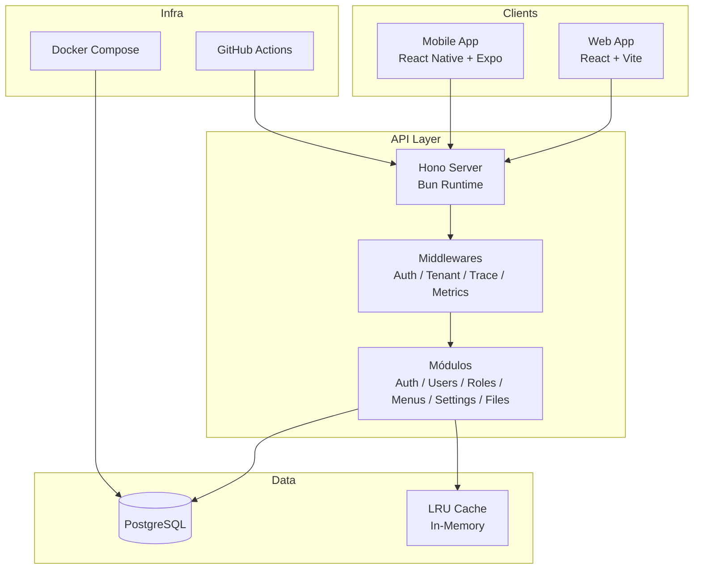
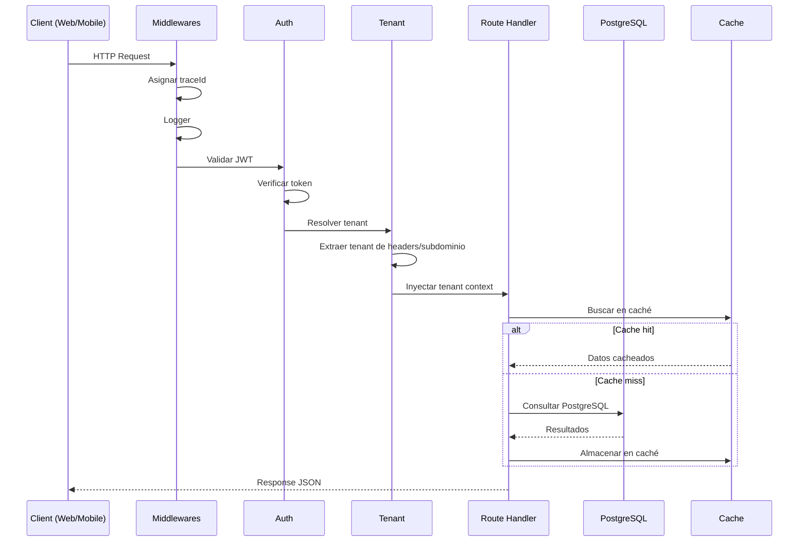

# Arquitectura General — BaseForge SaaS

> **BF-3105** — Versión 1.0 — 2026-06-14

---

## Diagrama de alto nivel



---

## Stack tecnológico

| Capa | Tecnología | Propósito |
|---|---|---|
| Runtime | Bun 1.1+ | JS/TS runtime, package manager, test runner |
| API Framework | Hono | Servidor HTTP ligero y rápido |
| Frontend Web | React 18 + Vite | Interfaz de usuario web |
| Frontend Mobile | React Native + Expo | Interfaz de usuario móvil |
| ORM | Drizzle ORM | Tipado seguro para PostgreSQL |
| Validación | Zod | Schemas de validación en API y frontend |
| Consultas | TanStack Query | Cache y estado de consultas remotas |
| Estado local | Zustand | Estado global del frontend |
| UI Web | Componentes propios + Radix | Sistema de diseño propio |
| DB | PostgreSQL 16 | Base de datos relacional |

---

## Principios arquitectónicos

### 1. Multitenancy

Cada inquilino (tenant) tiene datos aislados mediante `tenant_id` en todas las tablas. El tenant se resuelve automáticamente en cada request. [Ver más](../tenancy/multitenant-model.md).

### 2. API-first

Toda la lógica de negocio reside en la API. Los frontends son clientes que consumen endpoints REST.

### 3. Autorización en API

La API es la única fuente de verdad para permisos. El frontend nunca determina si una acción está permitida.

### 4. Paginación obligatoria

Todos los listados administrativos usan paginación server-side. No existen listados sin límite.

### 5. Cache con invalidación

Se usa caché LRU en memoria para datos de lectura frecuente (features, menús, settings). Se invalida automáticamente al escribir.

---

## Flujo de una petición



---

## Patrón de módulos

Cada módulo sigue esta estructura:

```
modules/
├── users/
│   ├── users.routes.ts      # Definición de rutas HTTP
│   ├── users.controller.ts  # Handlers de cada endpoint
│   ├── users.service.ts     # Lógica de negocio
│   └── users.repository.ts  # Consultas a base de datos
```

---

## Contrato de respuesta API

Todas las respuestas siguen este formato:

**Éxito:**
```json
{
  "success": true,
  "data": {},
  "meta": { "pagination": {} },
  "traceId": "uuid"
}
```

**Error:**
```json
{
  "success": false,
  "error": {
    "code": "VALIDATION_ERROR",
    "message": "Mensaje descriptivo",
    "details": []
  },
  "traceId": "uuid"
}
```
