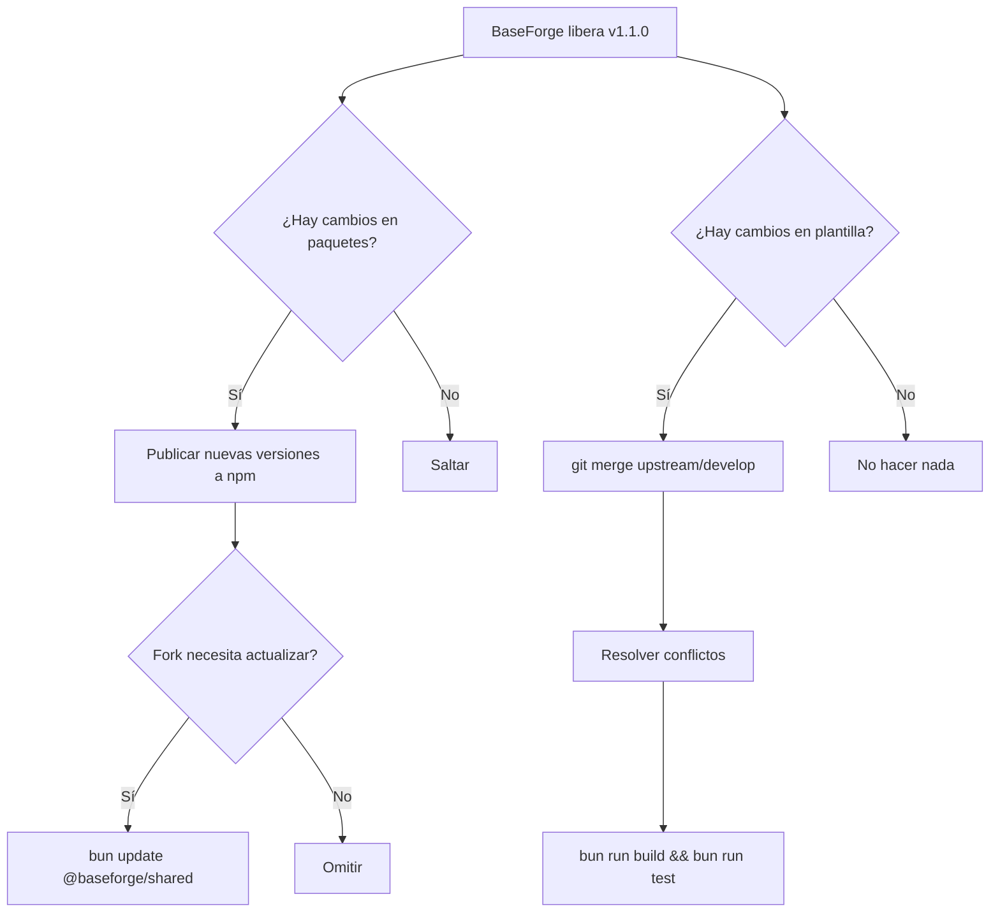

# Plantilla vs Paquetes — Estrategia de Actualización

> **BF-3301 / BF-3302** — Versión 1.0 — 2026-06-14

---

## Concepto

Para que los forks puedan recibir actualizaciones de BaseForge sin perder sus cambios,
dividimos el proyecto en dos categorías:

```
BaseForge SaaS
├── PLANTILLA (cambia con el tiempo)
│   ├── apps/api/         ← Módulos base (auth, users, roles, etc.)
│   ├── apps/web/         ← Layouts, componentes base, vistas
│   ├── apps/mobile/      ← Pantallas base
│   ├── database/         ← Migraciones, seeds
│   ├── infrastructure/   ← Docker, CI/CD
│   └── docs/             ← Documentación
│
└── PAQUETES (versionados independientemente)
    ├── @baseforge/shared     → Tipos e interfaces
    ├── @baseforge/validation → Schemas Zod
    ├── @baseforge/api-client → Cliente HTTP tipado
    ├── @baseforge/auth       → Lógica de autenticación
    ├── @baseforge/ui-web     → Componentes UI web
    └── @baseforge/ui-mobile  → Componentes UI mobile
```

---

## ¿Qué queda en la plantilla?

La plantilla es el repositorio completo que se clona para crear un fork.
Contiene TODO el código necesario para que el proyecto funcione por sí solo.

Los forks **modifican libremente** los archivos de la plantilla para agregar
su lógica de negocio. Al hacer merge de upstream, resolverán conflictos en
los archivos que modificaron.

### Archivos "core" que NO deben modificarse en un fork

| Archivo | Razón |
|---|---|
| `packages/*` | Se actualizan vía npm, no vía merge |
| `database/migrations/001_*` | Migración base del schema |
| `apps/api/src/middlewares/*` | Middlewares de infraestructura |
| `apps/api/src/common/*` | Utilidades base (caché, crypto, etc.) |
| `apps/api/src/database/schema.ts` | Schema base (fork agrega tablas aparte) |

### Archivos que SÍ se modifican en un fork

| Archivo | Uso típico |
|---|---|
| `apps/api/src/modules/*` | Módulos del negocio |
| `apps/web/src/views/*` | Vistas personalizadas |
| `apps/web/src/App.tsx` | Rutas del negocio |
| `database/migrations/003_*` | Migraciones del dominio |
| `docs/*` | Documentación del fork |

---

## ¿Qué va en paquetes?

Los paquetes son código **versionado independientemente** que los forks consumen
como dependencias. Esto permite:

1. Actualizar paquetes sin tocar el código del fork
2. Versionado semántico (major/minor/patch)
3. Publicar a npm (público o privado)
4. Compartir mejoras entre forks

### Paquetes actuales

| Paquete | Versión | Dependencias | Ámbito |
|---|---|---|---|
| `@baseforge/shared` | `0.1.0` | — | Tipos e interfaces |
| `@baseforge/validation` | `0.1.0` | zod | Schemas Zod |
| `@baseforge/api-client` | `0.1.0` | shared, validation | Cliente HTTP |
| `@baseforge/auth` | `0.1.0` | — | Lógica de auth |
| `@baseforge/ui-web` | `0.1.0` | — | UI web |
| `@baseforge/ui-mobile` | `0.1.0` | — | UI mobile |

### Estrategia de publicación

```bash
# Los paquetes se publican a npm (o registro privado)
cd packages/shared
npm publish --access public

# Los forks los consumen como dependencia
# package.json del fork:
{
  "dependencies": {
    "@baseforge/shared": "^0.1.0"
  }
}
```

---

## Flujo de actualización



---

## Recomendaciones para forks

1. **No modificar `packages/`** — esperar actualizaciones vía npm
2. **Usar `workspace:*` en desarrollo**, `^x.y.z` en producción
3. **Mantener `database/migrations/001_*` intacta**
4. **Agregar migraciones propias como `003_*`, `004_*`**
5. **Crear schemas propios en `apps/api/src/database/*-schema.ts`**
6. **Seguir el [guía de actualización](../development/fork-update-guide.md)**
