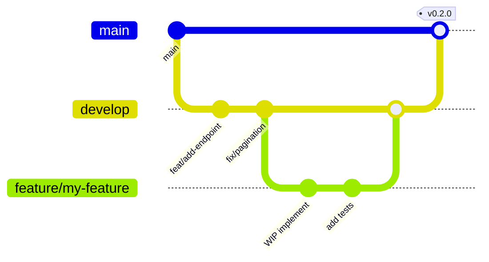

# Guía de Desarrollo — BaseForge SaaS

> **BF-3103** — Versión 1.0 — 2026-06-14

---

## Convenciones

### Nombres

| Elemento | Convención | Ejemplo |
|---|---|---|
| Código fuente | Inglés | `getUserById()` |
| Documentación | Español | `Guía de desarrollo` |
| Carpetas | `kebab-case` | `apps/api/src/modules/users/` |
| Archivos TypeScript | `kebab-case.ts` | `auth.service.ts` |
| Componentes React | `PascalCase.tsx` | `AppListView.tsx` |
| Variables/funciones | `camelCase` | `fetchUsers()` |
| Clases/tipos | `PascalCase` | `UserRepository` |
| Tablas PostgreSQL | `snake_case` | `platform_users` |
| Permisos | `recurso.accion` | `users.read` |

### Commits

Usar [Conventional Commits](https://www.conventionalcommits.org/):

```
feat: agregar endpoint de recuperación de contraseña
fix: corregir paginación en listado de usuarios
docs: actualizar guía de instalación
refactor: extraer lógica de caché a servicio propio
test: agregar pruebas unitarias para auth.service
chore: actualizar dependencias
```

---

## Estructura del monorepo

```
baseforge/
├── apps/
│   ├── api/       # API Bun + Hono
│   ├── web/       # Frontend React + Vite
│   └── mobile/    # App React Native + Expo
├── packages/
│   ├── shared/    # Tipos y utilidades compartidas
│   ├── validation/ # Esquemas Zod
│   ├── api-client/ # Cliente HTTP tipado
│   ├── auth/      # Lógica de autenticación
│   ├── ui-web/    # Componentes UI web
│   └── ui-mobile/ # Componentes UI mobile
├── database/
│   ├── migrations/ # Migraciones SQL
│   ├── seeds/      # Datos iniciales
│   └── scripts/    # Utilidades de BD
├── docs/          # Documentación
└── infrastructure/ # Docker, CI/CD
```

---

## Comandos principales

```bash
# Desarrollo
bun run dev          # Inicia todo el monorepo
bun run dev --filter=@baseforge/api   # Solo API
bun run dev --filter=@baseforge/web   # Solo web

# Construcción
bun run build        # Compila todo
bun run build --filter=@baseforge/web

# Pruebas
bun run test         # Todos los tests
bun run test --filter=@baseforge/api  # Tests de API

# Calidad
bun run lint         # ESLint
bun run typecheck    # TypeScript

# Base de datos
bun run db:migrate   # Ejecutar migraciones
bun run db:seed      # Sembrar datos
bun run db:reset     # Resetear BD completa
bun run db:studio    # Abrir Drizzle Studio
```

---

## Flujo de trabajo



1. Crear rama desde `develop`: `git checkout -b feature/mi-feature develop`
2. Implementar y escribir pruebas
3. Asegurar que `bun run lint && bun run typecheck && bun run test` pase
4. Crear PR hacia `develop`
5. Tras revisión, hacer squash merge
6. Releases desde `develop` → `main` con versionado semántico

---

## APIs y estándares

- Formato de respuesta: [Contrato estándar API](../api/api-contract.md)
- Paginación: [Guía de paginación](../api/pagination.md)
- Autenticación: [Guía de autenticación](../security/authentication.md)
- Errores: Todos los errores siguen el formato `{ success: false, error: { code, message, details } }`
