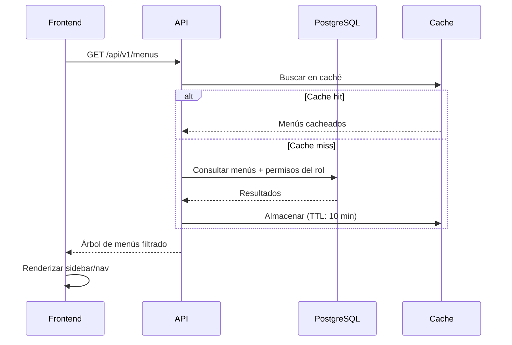

# Menús Dinámicos — BaseForge SaaS

> **BF-3110** — Versión 1.0 — 2026-06-14

---

## Concepto

Los menús se definen en base de datos y se asignan a roles mediante permisos. Esto permite:

- Definir menús diferentes por tenant
- Mostrar/ocultar ítems según el rol del usuario
- Cambiar la navegación sin desplegar código
- Menús distintos para web y mobile

---

## Estructura de datos

```typescript
interface MenuItem {
  id: string;
  code: string;         // Código único: "tenant.dashboard"
  label: string;        // Texto visible: "Dashboard"
  route: string;        // Ruta: "/app/dashboard"
  icon: string;         // Nombre del icono Lucide: "Home"
  parentId: string | null; // Menú padre (jerarquía)
  sortOrder: number;    // Orden de aparición
  platform: "WEB" | "MOBILE" | "BOTH";
  requiredPermissionId: string | null; // Permiso necesario
  requiredFeatureCode: string | null;  // Feature flag necesario
  isVisible: boolean;
  isActive: boolean;
}
```

---

## Resolución de menús



---

## Panel de administración

Los superadmins pueden gestionar menús desde:

`/superadmin/menus`

Funcionalidades:
- CRUD completo de menús
- Asignación de permisos requeridos
- Asignación de feature flags
- Organización jerárquica (padre-hijo)
- Ordenamiento por sort order
- Filtro por plataforma (WEB, MOBILE, BOTH)
