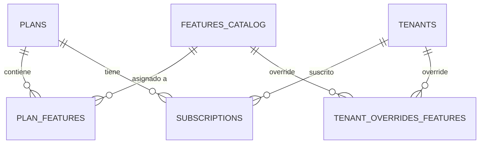

# Planes y Suscripciones — BaseForge SaaS

> **BF-3111** — Versión 1.0 — 2026-06-14

---

## Modelo



---

## Planes

| Campo | Descripción | Ejemplo |
|---|---|---|
| `code` | Código único | `ENTERPRISE_PRO` |
| `name` | Nombre visible | `Enterprise Pro` |
| `billingCycle` | Ciclo de facturación | `MONTHLY`, `ANNUAL`, `FREE` |
| `price` | Precio en `currencyCode` | `299000` |
| `trialDays` | Días de prueba | `15` |
| `isPublic` | Visible en registro | `true` |

---

## Características (Features)

Cada plan tiene una lista de características habilitadas:

| Feature | Tipo | Plan Básico | Plan Pro | Enterprise |
|---|---|---|---|---|
| `MAX_USERS` | NUMBER | 10 | 50 | ∞ |
| `STORAGE_GB` | NUMBER | 5 | 50 | 500 |
| `REALTIME_CHAT` | BOOLEAN | false | true | true |
| `API_ACCESS` | BOOLEAN | false | true | true |
| `AUDIT_LOG` | BOOLEAN | false | false | true |

---

## Overrides por tenant

Los superadmins pueden habilitar características específicas para un tenant, incluso si no están incluidas en su plan:

```json
{
  "tenantId": "uuid",
  "featureId": "uuid",
  "enabled": true,
  "validUntil": "2026-12-31T23:59:59Z"
}
```

---

## Endpoints

| Método | Ruta | Propósito |
|---|---|---|
| `GET` | `/api/v1/superadmin/plans` | Listar planes (superadmin) |
| `POST` | `/api/v1/superadmin/plans` | Crear plan |
| `GET` | `/api/v1/superadmin/plans/:id/features` | Features de un plan |
| `POST` | `/api/v1/superadmin/plans/:id/features` | Asignar features a plan |
| `GET` | `/api/v1/superadmin/features` | Catálogo de features |
| `POST` | `/api/v1/superadmin/features` | Crear feature |
| `GET` | `/api/v1/superadmin/tenants/:id/features` | Overrides del tenant |
| `POST` | `/api/v1/superadmin/tenants/:id/features` | Guardar overrides |
