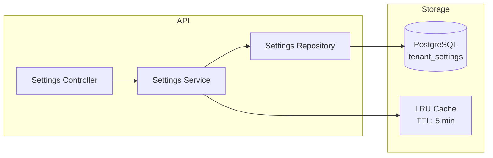

# Configuración por Tenant — BaseForge SaaS

> **BF-3112** — Versión 1.0 — 2026-06-14

---

## Concepto

Cada tenant puede personalizar su instancia sin modificar código fuente:

| Categoría | Ejemplos |
|---|---|
| General | Nombre de la app, idioma por defecto, huso horario |
| Branding | Color primario, logo, favicon |
| Localización | Moneda, formato de fecha, zona horaria |
| Notificaciones | Configuración de correos, canales habilitados |
| Seguridad | Política de contraseñas, 2FA, sesiones |

---

## Arquitectura



---

## Endpoints

| Método | Ruta | Auth | Propósito |
|---|---|---|---|
| `GET` | `/api/v1/settings/public` | ❌ No | Branding público (login, home) |
| `GET` | `/api/v1/settings` | ✅ Sí | Configuración completa del tenant |
| `PUT` | `/api/v1/settings` | ✅ Sí | Actualizar configuración |

---

## Tipos de valor

| Tipo | Descripción | Ejemplo |
|---|---|---|
| `STRING` | Texto | Nombre de la app |
| `NUMBER` | Número entero/decimal | Tiempo de sesión en minutos |
| `BOOLEAN` | Verdadero/falso | Habilitar registro público |
| `JSON` | Objeto estructurado | Redes sociales |
| `SECRET_REFERENCE` | Valor cifrado (AES-256-GCM) | API Key de correo |

---

## Seguridad de secretos

Los valores de tipo `SECRET_REFERENCE` se cifran con AES-256-GCM usando `JWT_ACCESS_SECRET` como clave. Al consultar, la API devuelve `"********"` en lugar del valor real.

---

## Branding dinámico

El frontend consulta `/api/v1/settings/public` al cargar y aplica:

```css
/* Color primario del tenant */
:root {
  --color-primary: <branding.primary_color>;
}
```

Esto permite que cada tenant tenga su propia identidad visual sin builds separados.
