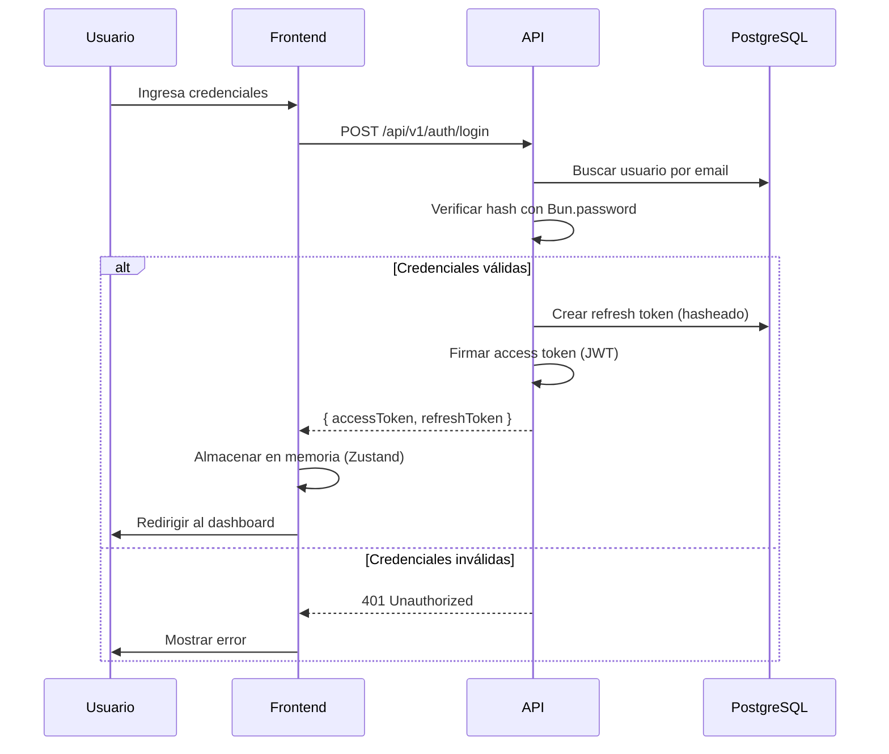

# Autenticación — BaseForge SaaS

> **BF-3108** — Versión 1.0 — 2026-06-14

---

## Flujo de autenticación



---

## Endpoints

| Método | Ruta | Propósito |
|---|---|---|
| `POST` | `/api/v1/auth/login` | Iniciar sesión |
| `POST` | `/api/v1/auth/logout` | Cerrar sesión |
| `POST` | `/api/v1/auth/refresh` | Renovar access token |
| `POST` | `/api/v1/auth/forgot-password` | Solicitar recuperación |
| `POST` | `/api/v1/auth/reset-password` | Restablecer contraseña |
| `GET` | `/api/v1/auth/me` | Obtener perfil actual |

---

## Payload del JWT

```json
{
  "sub": "uuid-del-usuario",
  "email": "user@example.com",
  "roles": ["TENANT_ADMIN"],
  "tenantId": "uuid-del-tenant",
  "tokenVersion": 1,
  "iat": 1718000000,
  "exp": 1718000900
}
```

---

## Refresh Token Rotativo

Cada vez que se usa un refresh token:

1. Se valida el hash contra la BD
2. Se revoca el token actual
3. Se genera un nuevo par (access + refresh)
4. El nuevo refresh token pertenece a la misma `family_id`

**Detección de robo:** Si un refresh token ya revocado se reutiliza, se invalida toda la familia.

---

## Cierre de sesión

- El frontend limpia el token de memoria
- La API revoca el refresh token en BD
- Opcionalmente se incrementa `token_version` para invalidar todos los tokens del usuario
