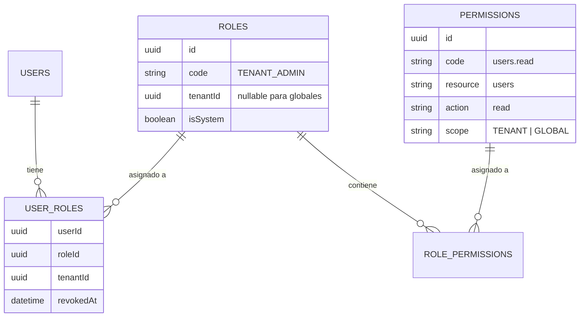

# Roles y Permisos — BaseForge SaaS

> **BF-3109** — Versión 1.0 — 2026-06-14

---

## Modelo de datos



---

## Roles del sistema

| Rol | Ámbito | Descripción |
|---|---|---|
| `SUPER_ADMIN` | Global | Acceso completo a toda la plataforma |
| `TENANT_ADMIN` | Tenant | Administración del inquilino |
| `MANAGER` | Tenant | Gestión operativa |
| `VIEWER` | Tenant | Solo lectura |

---

## Formato de permisos

Los permisos usan el formato `resource.action`:

| Código | Descripción |
|---|---|
| `users.read` | Ver listado de usuarios |
| `users.create` | Crear usuarios |
| `users.update` | Editar usuarios |
| `users.delete` | Eliminar usuarios |
| `roles.read` | Ver listado de roles |
| `roles.create` | Crear roles |
| `roles.update` | Editar roles |
| `roles.delete` | Eliminar roles |
| `settings.read` | Ver configuración |
| `settings.update` | Modificar configuración |
| `tenants.read` | Ver inquilinos (superadmin) |
| `audit.read` | Ver logs de auditoría |

---

## Verificación de permisos

```typescript
// Middleware de autorización
async function requirePermission(permissionCode: string) {
  return async (c, next) => {
    const user = c.get("user");
    const tenantId = c.get("tenantId");

    const hasPermission = await checkPermission(user.id, tenantId, permissionCode);
    if (!hasPermission) {
      return c.json({ success: false, error: { code: "FORBIDDEN", message: "No tienes permiso para esta acción." } }, 403);
    }

    await next();
  };
}
```

---

## Menús dinámicos por rol

Los menús visibles se determinan según los permisos del usuario:

```typescript
const menus = await db.query.menus.findMany({
  where: and(
    eq(menus.tenantId, tenantId),
    eq(menus.isActive, true),
    eq(menus.isVisible, true),
    isNull(menus.deletedAt),
  ),
  // Filtrados por permisos del usuario
});
```

Ver [Menús dinámicos](../development/dynamic-menus.md).
